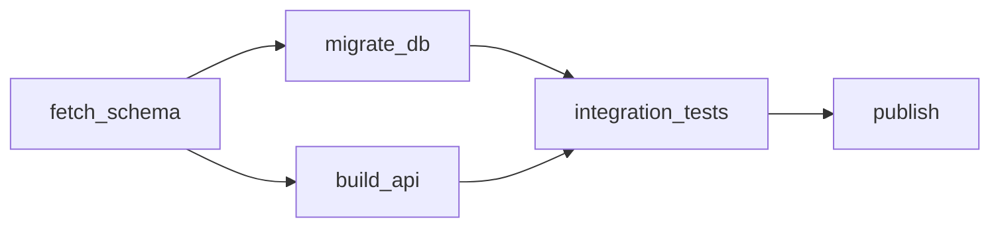

# Workflow Documentation Patterns Workflow

Documenting a workflow so the next person — often the on-call engineer at 3am — can
understand what it does, why, and what to do when it breaks.

Workflow documentation decays faster than most, because the definition changes
without the prose. The organising principle is therefore: **generate what can be
generated, and hand-write only what cannot.**

---

## 1. Separate generated from authored

Anything derivable from the definition should never be typed by hand — it is stale
the first time the definition changes.

| Content | Source |
|---------|--------|
| Step list, dependency graph, schedule | **Generated** from the definition |
| Inputs, outputs, schemas | **Generated** from declarations |
| Owner, SLA, escalation path | Authored (metadata in the definition) |
| Why it exists, why it is shaped this way | Authored |
| Failure modes and their remedies | Authored |

### Implementation:
```yaml
metadata:
  owner: team/data-platform
  slack: "#data-platform-oncall"
  sla: {completion_by: "06:00 UTC", severity_if_missed: high}
  purpose: >
    Produces the daily revenue rollup that finance closes the books against.
    Missing it delays month-end; wrong numbers are worse than late numbers.
  upstream: [orders_ingest, fx_rates]
  downstream: [finance_close, exec_dashboard]
```

Put authored metadata **in the definition**, not in a wiki. Co-located
documentation is reviewed in the same pull request as the change; a wiki page is not.

### Advantages & Disadvantages:
- **Advantage:** The generated majority can never go stale
- **Advantage:** Authored parts are reviewed alongside the code they describe
- **Disadvantage:** Requires the metadata schema to be enforced, or fields go unfilled

---

## 2. Generate the diagram

A dependency graph in prose is unreadable past about five steps.



Generate it from the definition on every change and embed it. A hand-drawn diagram
is wrong within two sprints, and a wrong diagram is worse than none — people trust it.

---

## 3. The runbook is the document that matters

Most workflow documentation is read during an incident. Structure it for that, not
for onboarding.

### Implementation Strategy:
```markdown
## Runbook: nightly_rollup

**Impact if failed:** Finance cannot close; exec dashboard shows yesterday.
**Owner:** #data-platform-oncall     **SLA:** complete by 06:00 UTC

### Symptom: run did not start
1. Check scheduler health: <link>
2. Check upstream `orders_ingest` completed: <query>
3. If upstream is late, wait — do not trigger manually before it lands
   (double-counts rows).

### Symptom: run failed at `transform`
1. Check the DLQ depth: <link>
2. Common cause: a new currency code missing from `fx_rates`.
   Fix: add the code, then re-run — the step is idempotent.
3. Escalate to @data-platform if the DLQ exceeds 100.

### Safe to re-run?
Yes — all steps are idempotent and keyed on `(date, region)`.

### Safe to skip a day?
No. Downstream aggregates assume continuity; skipping requires a backfill.
```

The two questions on-call actually asks are **"can I just re-run it?"** and **"what
breaks if I do nothing?"**. Answer both explicitly, near the top.

---

## 4. Document decisions, not mechanics

The definition already states *what* happens. What it cannot state is why.

```markdown
### Why this is one workflow and not three
Splitting by region was tried in 2026-03 (see ADR-014). The FX conversion
needs a globally consistent rate snapshot, so the regions cannot advance
independently. Keep them in one run.

### Why the retry limit is 2 and not 5
`charge_card` is idempotent only within a 10-minute window. Attempt 3 can fall
outside it and double-charge.
```

Record these where the constraint lives. A retry limit that looks arbitrary will be
"tidied up" by someone eventually; a one-line comment on why prevents an incident.

---

## 5. Keep it honest automatically

Documentation that is not verified drifts, and drifted documentation is trusted
right up until it misleads someone during an incident.

```yaml
doc_checks:
  - every_workflow_has: [owner, purpose, sla, runbook_url]
  - runbook_links_resolve: true
  - diagram_matches_definition: true      # regenerate and diff in CI
  - orphaned_runbooks: fail               # runbook for a deleted workflow
```

Fail CI on these. A documentation check that only warns is a documentation check
that is ignored.

---

## Best Practices

1. **Generate everything derivable;** author only intent, ownership, and remedies.
2. **Store authored metadata in the definition** so it is reviewed with the change.
3. **Regenerate the diagram in CI** and fail on drift.
4. **Write the runbook for 3am,** not for onboarding.
5. **Answer "is it safe to re-run?" and "what if I do nothing?"** explicitly.
6. **Record why constraints exist** next to the constraint.
7. **Name a human owner and an escalation path,** not just a team alias.
8. **Fail CI on missing or stale documentation.**

---

## Common Pitfalls

- **Hand-maintained step lists.** Stale on the next change, and confidently wrong.
- **Wiki-only documentation.** Not reviewed with the change; drifts immediately.
- **Runbooks that describe the happy path.** Nobody reads a runbook when it works.
- **No re-run guidance.** On-call guesses, and guesses wrong on non-idempotent steps.
- **Mechanics without rationale.** The next engineer removes the constraint that
  was load-bearing.
- **Owner listed as a departed individual** or a dead alias.
- **Warn-only doc checks.** Universally ignored.

---

## Related Patterns

- `workflow-dependency-management` — the graph the generated diagram renders
- `workflow-monitoring` — the dashboards and alerts a runbook links to
- `workflow-error-handling-patterns` — the failure modes the runbook documents
- `docs` — general documentation structure and conventions