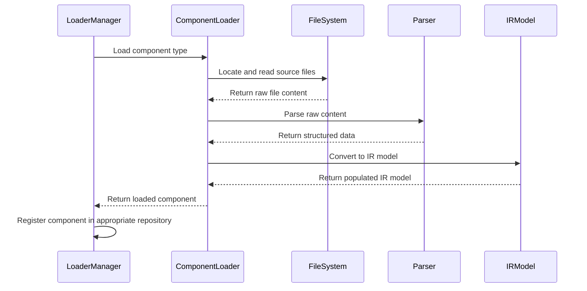
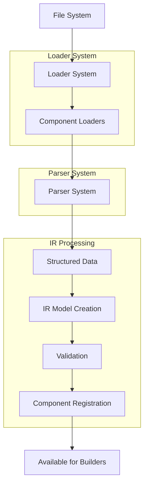

# Loader and Parser Architecture

## Overview

The Loader and Parser architecture in Prompticorn is responsible for loading prompt source files and parsing them into Intermediate Representation (IR) models. This system separates the concerns of file loading (locating and reading files) from content parsing (converting raw content into structured data).

## Core Components

### Loader Base Classes
**Location:** `prompticorn/ir/loaders/`

The loader system consists of specialized loader classes, each responsible for loading a specific type of component:

- **ComponentLoader:** Base class for all component loaders
- **SkillLoader:** Loads skill definitions from YAML files
- **WorkflowLoader:** Loads workflow definitions from YAML files
- **AgentSkillMappingLoader:** Loads mappings between agents and skills
- **AgentWorkflowMappingLoader:** Loads mappings between agents and workflows
- **LanguageSkillMappingLoader:** Loads mappings between skills and programming languages
- **CoreFilesLoader:** Loads always-on core configuration files

### Parser Base Classes
**Location:** `prompticorn/ir/parsers/`

The parser system consists of specialized parser classes, each responsible for parsing a specific file format:

- **BaseParser:** Abstract base class for all parsers
- **MarkdownParser:** Parses markdown files with frontmatter
- **YAMLParser:** Parses YAML files

## Component Loading Process



### ComponentLoader Base Class
**File:** `prompticorn/ir/loaders/component_loader.py`

The ComponentLoader base class provides common functionality for all component loaders:

**Key Methods:**
- `load(component_type)`: Load all components of a given type
- `load_single(component_id)`: Load a single component by ID
- `get_file_path(component_id)`: Get file path for a component
- `parse_content(raw_content)`: Parse raw file content into structured data
- `validate_component(component_data)`: Validate loaded component data
- `create_component(parsed_data)`: Create IR model from parsed data

### Specialized Loaders

#### SkillLoader
**File:** `prompticorn/ir/loaders/skill_loader.py`

Loads skill definitions from YAML files in the skills directory.

**Loading Process:**
1. Locate all `.yaml` and `.yml` files in skills directory
2. For each file, load and parse YAML content
3. Validate each skill definition against Skill IR model
4. Create Skill IR model instances
5. Register skills in the skill repository

#### WorkflowLoader
**File:** `prompticorn/ir/loaders/workflow_loader.py`

Loads workflow definitions from YAML files in the workflows directory.

**Loading Process:**
1. Locate all `.yaml` and `.yml` files in workflows directory
2. For each file, load and parse YAML content
3. Validate each workflow definition against Workflow IR model
4. Create Workflow IR model instances
5. Register workflows in the workflow repository

#### AgentLoader
**File:** `prompticorn/ir/loaders/agent_loader.py` (conceptual - may be part of component loader)

Loads agent definitions from YAML files in the agents directory.

**Loading Process:**
1. Locate all `.yaml` and `.yml` files in agents directory
2. For each file, load and parse YAML content
3. Validate each agent definition against Agent IR model
4. Create Agent IR model instances
5. Register agents in the agent repository

#### Mapping Loaders
Load various mapping files that define relationships between components:

- **AgentSkillMappingLoader:** Loads agent-skill mappings
- **AgentWorkflowMappingLoader:** Loads agent-workflow mappings
- **LanguageSkillMappingLoader:** Loads language-skill mappings

### Parser System

#### BaseParser
**File:** `prompticorn/ir/parsers/__init__.py`

Abstract base class defining the parser interface:

**Key Methods:**
- `parse(content)`: Abstract method to parse raw content into structured data
- `can_parse(file_path)`: Check if parser can handle given file type
- `get_supported_extensions()`: Get list of supported file extensions

#### MarkdownParser
**File:** `prompticorn/ir/parsers/markdown_parser.py`

Parses markdown files with YAML frontmatter:

**Parsing Process:**
1. Split content into frontmatter and body sections
2. Parse frontmatter as YAML
3. Validate frontmatter against expected schema
4. Return structured data with frontmatter and body
5. Handle edge cases (missing frontmatter, invalid YAML)

**Supported Format:**
```yaml
---
name: "component-name"
description: "Component description"
# ... other fields
---

# Component body content
This is the main content of the component.
```

#### YAMLParser
**File:** `prompticorn/ir/parsers/yaml_parser.py`

Parses plain YAML files:

**Parsing Process:**
1. Load and parse entire file as YAML
2. Validate parsed data against expected schema
3. Return structured data
4. Handle parsing errors gracefully

## Data Flow and Integration



## Caching and Performance

The loader system implements caching to improve performance:

### Loader Caching
- Loaded components are cached in memory to avoid repeated file I/O
- Cache invalidation occurs when source files are modified
- Different caching strategies for different component types

### Parser Caching
- Parsed templates are cached to avoid repeated parsing
- Template content is cached with file modification time checks
- LRU cache used for template loading to limit memory usage

## Extending the Loader System

### Adding New Component Types

To add support for a new component type:

1. **Create New Loader Class:**
```python
from prompticorn.ir.loaders.component_loader import ComponentLoader
from prompticorn.ir.models import MyComponentModel
from typing import List, Optional

class MyComponentLoader(ComponentLoader):
    def __init__(self):
        super().__init__("my_components", ".yaml")
    
    def create_component(self, parsed_data: dict) -> MyComponentModel:
        return MyComponentModel(**parsed_data)
    
    def validate_component(self, component_data: dict) -> list[str]:
        # Validate component-specific requirements
        errors = []
        # Add validation logic
        return errors
```

2. **Register Loader:**
```python
from prompticorn.ir.loaders import LOADER_REGISTRY

LOADER_REGISTRY.register("my_component", MyComponentLoader())
```

3. **Use Loader:**
```python
from prompticorn.ir.loaders import get_loader

loader = get_loader("my_component")
components = loader.load_all()
```

### Adding New Parser Types

To add support for a new file format:

1. **Create New Parser Class:**
```python
from prompticorn.ir.parsers import BaseParser
from typing import Any

class MyFormatParser(BaseParser):
    def parse(self, content: str) -> Any:
        # Parse content in my format
        return parsed_data
    
    def can_parse(self, file_path: str) -> bool:
        return file_path.endswith(".myext")
    
    def get_supported_extensions(self) -> list[str]:
        return [".myext"]
```

2. **Register Parser:**
```python
from prompticorn.ir.parsers import PARSER_REGISTRY

PARSER_REGISTRY.register(".myext", MyFormatParser())
```

3. **Update Loader:**
```python
# In your component loader
def parse_content(self, raw_content: str) -> dict:
    parser = PARSER_REGISTRY.get_parser_for_extension(".myext")
    return parser.parse(raw_content)
```

## Best Practices

1. **Separate Concerns:** Keep loading logic separate from parsing logic
2. **Handle Errors Gracefully:** Provide meaningful error messages for loading/parsing failures
3. **Validate Early:** Validate component data as soon as possible after parsing
4. **Use Caching Wisely:** Cache frequently accessed data but invalidate appropriately
5. **Follow Naming Conventions:** Use consistent naming for loader and parser classes
6. **Support Multiple Formats:** Design loaders to work with multiple file formats when possible
7. **Keep Loaders Stateless:** Loaders should not maintain state between loading operations
8. **Use Type Hints:** Leverage Python's type hints for better IDE support and error detection
9. **Document Loading Process:** Clearly document how each component type is loaded and validated
10. **Test Edge Cases:** Test loading and parsing with malformed files, missing files, and empty content
