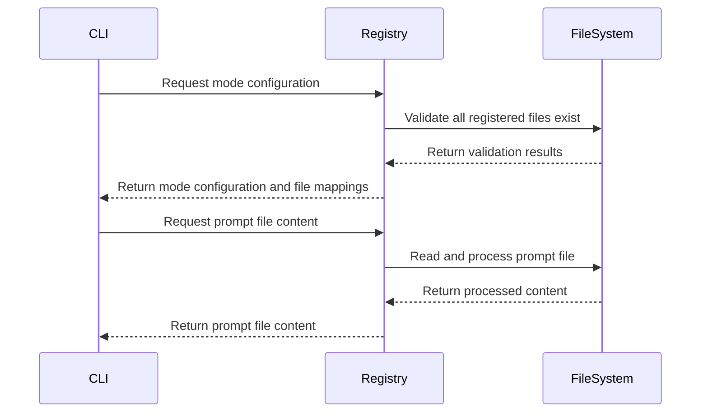

# Registry and Discovery System

## Overview

The Registry system serves as the single source of truth for all modes, their associated prompt files, and output ordering in prompticorn. It validates that all registered files exist and provides methods for generating various ignore files.

## Core Components

### Registry Class
**File:** `prompticorn/registry.py`

The Registry class is a Pydantic model that contains all mode and file registrations. It validates that all registered files exist in the prompts directory and provides methods for generating ignore files for different AI tools.

**Key Attributes:**
- `prompts_dir`: Path to the prompts directory containing all .md files
- `always_on`: List of prompt files that apply to all modes (core system files)
- `modes`: Dictionary mapping mode keys to display names
- `mode_files`: Dictionary mapping mode keys to their prompt files
- `concat_order`: Ordered list of (section_label, filename) tuples for output
- `default_ignore_patterns`: List of glob patterns for ignore files
- `copilot_apply`: Dictionary mapping modes to glob patterns for Copilot

### Mode Registry
The modes dictionary maps internal mode keys to user-friendly display names:

```python
modes: dict[str, str] = {
    "architect": "Architect",
    "test": "Test",
    "refactor": "Refactor",
    "document": "Document",
    "explain": "Explain",
    "migration": "Migration",
    "code": "Code",
    "review": "Review",
    "debug": "Debug",
    "ask": "Ask",
    "security": "Security",
    "compliance": "Compliance",
    "orchestrator": "Orchestrator",
    "enforcement": "Enforcement",
    "planning": "Planning",
}
```

### Mode Files Mapping
The mode_files dictionary maps each mode to its associated prompt files:

```python
mode_files: dict[str, list[str]] = {
    "architect": [
        "agents/architect/subagents/architect-scaffold.md",
        "agents/architect/subagents/architect-task-breakdown.md",
        "agents/architect/subagents/architect-data-model.md",
    ],
    "test": [
        "agents/test/subagents/test-strategy.md",
    ],
    # ... other modes
}
```

### Concatenation Order
The concat_order list defines the order in which sections appear in concatenated output:

```python
concat_order: list[tuple[str, str]] = [
    ("CORE BEHAVIORS", "agents/core/core-system.md"),
    ("CONVENTIONS", "agents/core/core-conventions.md"),
    ("SESSION MANAGEMENT", "agents/core/core-session.md"),
    # ... other sections
]
```

## Key Functions

### File Validation
The Registry validates that all registered files exist:

```python
def validate_files(self) -> list[str]:
    """Check every registered filename exists in prompts/."""
    errors: list[str] = []
    
    # Check always_on and mode_files
    for fname in self.all_registered_files:
        if not self.prompt_path(fname).exists():
            errors.append(f"MISSING: {fname}")
    
    # Check concat_order references
    for label, fname in self.concat_order:
        if fname not in self.all_registered_files:
            errors.append(f"CONCAT_ORDER '{label}': '{fname}' not in any mode or ALWAYS_ON")
    
    # Check for orphan files
    for p in self.prompts_dir.glob("*.md"):
        if p.name not in self.all_registered_files:
            errors.append(f"ORPHAN: {p.name} exists in prompts/ but is not registered")
    
    return errors
```

### Prompt File Access
Methods for accessing and processing prompt files:

```python
def prompt_path(self, filename: str) -> Path:
    """Get absolute path to a prompt file."""
    return self.prompts_dir / filename

def prompt_body(self, filename: str) -> str:
    """Read a prompt file and strip the header comment."""
    return _prompt_body_cached(self.prompts_dir, filename)

def dest_name(self, mode_key: str, filename: str, ext: str = ".md") -> str:
    """Strip the mode prefix from a filename for output."""
    return _dest_name(mode_key, filename, ext)
```

### Ignore File Generation
The Registry generates ignore files for various AI tools:

```python
def generate_gitignore(self) -> str:
    """Generate .gitignore content from default patterns."""
    # Returns complete .gitignore content

def generate_clineignore(self) -> str:
    """Generate .clineignore content for Cline."""
    # Returns complete .clineignore content

def generate_cursorignore(self) -> str:
    """Generate .cursorignore content for Cursor."""
    # Returns complete .cursorignore content

def generate_kiloignore(self) -> str:
    """Generate .kiloignore content for Kilo Code."""
    # Returns complete .kiloignore content

def generate_copilotignore(self) -> str:
    """Generate .copilotignore content for GitHub Copilot."""
    # Returns complete .copilotignore content
```

## Data Flow and Usage



## Extending the Registry

To add a new mode:

1. Add it to the `modes` dictionary (key → display label)
2. Add its files to `mode_files` (key → ordered list of filenames from prompts/)
3. Add entries to `concat_order` for tools that use flat concatenated output

To add a new file to an existing mode:

1. Drop the .md file in prompts/
2. Add the filename to `mode_files[mode]`
3. Add a `concat_order` entry with the section label

## Best Practices

1. **Keep Registry Immutable:** The Registry uses Pydantic's frozen=True to prevent modification after creation
2. **Validate File Existence:** The Registry validates that all registered files actually exist
3. **Use Consistent Naming:** Follow established naming conventions for mode keys and section labels
4. **Maintain Concatenation Order:** Keep concat_order updated when adding/removing files
5. **Leverage Caching:** The Registry uses lru_cache for prompt file reading to improve performance
6. **Provide Clear Error Messages:** Validation errors should clearly indicate what's missing or incorrect
7. **Separate Concerns:** Keep mode configuration separate from file content processing
8. **Support Tool-Specific Patterns:** Different tools may need different ignore patterns and file processing
