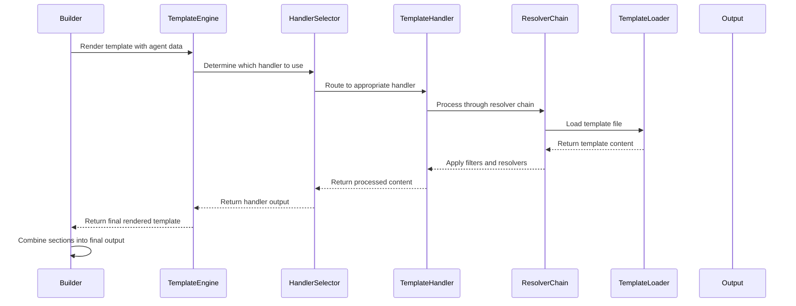

# Template Substitution System

## Overview

The Template Substitution System in Promptosaurus processes Jinja2 templates with custom filters, resolvers, and error handling to generate tool-specific output from Intermediate Representation (IR) models. It provides a flexible and powerful templating engine with built-in error recovery and extensibility.

## Core Components

### Template Handler Base Class
**File:** `promptosaurus/builders/template_handlers/template_handler.py`

The TemplateHandler base class defines the interface for all template handlers. Each handler is responsible for processing a specific section of the agent configuration (e.g., skills, workflows, tools).

**Key Methods:**
- `handle(agent, options)`: Abstract method to process agent data and return template content
- `get_template_name()`: Get the name of the template file to use
- `get_context(agent, options)`: Get the template context data for rendering

### Specialized Template Handlers
Located in `promptosaurus/builders/template_handlers/`, each handler processes a specific aspect of agent configuration:

- **SkillsHandler:** Processes skills section
- **WorkflowsHandler:** Processes workflows section
- **ToolsHandler:** Processes tools section
- **RulesHandler:** Processes rules section
- **SubagentsHandler:** Processes subagents section
- **FormatterHandler:** Processes formatter configuration
- **LinterHandler:** Processes linter configuration
- **CoverageHandler:** Processes coverage configuration
- **PackageManagerHandler:** Processes package manager configuration
- **MockingLibraryHandler:** Processes mocking library configuration
- **TestingFrameworkHandler:** Processes testing framework configuration
- **TestRunnerHandler:** Processes test runner configuration
- **RuntimeHandler:** Processes runtime configuration
- **MutationToolHandler:** Processes mutation tool configuration
- **E2EToolHandler:** Processes end-to-end tool configuration

### Template Resolvers
Located in `promptosaurus/builders/template_handlers/resolvers/`, resolvers provide additional functionality to the template system:

- **Jinja2TemplateRenderer:** Custom Jinja2 environment with safe filters and error handling
- **CustomFilters:** Project-specific Jinja2 filters (e.g., for string manipulation, formatting)
- **SafeFilters:** Security-focused filters to prevent template injection attacks
- **TemplateValidator:** Validates template syntax and content before rendering
- **ErrorRecovery:** Provides graceful error handling and fallback mechanisms
- **RegistryTemplateLoader:** Loads templates from the registry system
- **TemplateRenderingError:** Custom exception for template rendering errors

## Data Flow and Processing



## Template Processing Pipeline

1. **Template Selection:** Builder determines which template to use based on agent type and build options
2. **Context Preparation:** TemplateHandler prepares context data from agent model and build options
3. **Template Loading:** RegistryTemplateLoader loads template file from prompts directory
4. **Resolver Chain:** Template passes through custom filters, safe filters, and validation
5. **Rendering:** Jinja2 engine renders template with context data
6. **Error Recovery:** Any rendering errors are caught and handled gracefully
7. **Output Assembly:** Builder combines all processed sections into final output

## Custom Filters

The system includes several custom Jinja2 filters for common templating needs:

### String Manipulation Filters
- `kebab_case`: Convert string to kebab-case
- `snake_case`: Convert string to snake_case
- `pascal_case`: Convert string to PascalCase
- `camel_case`: Convert string to camelCase
- `trim`: Remove whitespace from beginning and end
- `truncate`: Truncate string to specified length

### Formatting Filters
- `indent`: Indent multiline string by specified amount
- `wrap`: Wrap text to specified width
- `format_list`: Format list as bullet points or numbered list
- `format_dict`: Format dictionary as key-value pairs

### Conditional Filters
- `default_if_empty`: Return default value if input is empty
- `is_enabled`: Check if feature should be included based on build options
- `has_items`: Check if collection has items

### Utility Filters
- `length`: Get length of collection or string
- `unique`: Remove duplicates from list
- `sort`: Sort list alphabetically
- `reverse`: Reverse list or string

## Error Handling and Recovery

The template system includes robust error handling mechanisms:

### Template Validation
Before rendering, templates are validated for:
- Syntax errors
- Missing required variables
- Invalid filter usage
- Security violations

### Graceful Degradation
When template errors occur:
1. Log detailed error information
2. Attempt to use fallback template if available
3. Return minimal valid output if possible
4. Provide clear error messages to user

### Error Recovery Strategies
- **Fallback Templates:** Use simplified template when primary template fails
- **Partial Rendering:** Render successful sections and skip failed ones
- **Default Values:** Use default values for missing or invalid data
- **Error Reporting:** Include error information in output when appropriate

## Integration with Builder System

Template handlers are invoked by builders during the build process:

```mermaid
graph TD
    A[Builder.build()] --> B[Prepare Context]
    B --> C[Select Template Handler]
    C --> D[Load Template]
    D --> E[Apply Resolvers & Filters]
    E --> F[Render Template]
    F --> G[Handle Errors]
    G --> H[Return Processed Section]
    H --> I[Combine with Other Sections]
    I --> J[Return Final Output]
```

## Extending the Template System

### Adding New Template Handlers

To create a new template handler:

1. **Inherit from TemplateHandler:**
```python
from promptosaurus.builders.template_handlers.template_handler import TemplateHandler
from promptosaurus.ir.models import Agent
from promptosaurus.builders.base import BuildOptions
from typing import Any

class MySectionHandler(TemplateHandler):
    def handle(self, agent: Agent, options: BuildOptions) -> str:
        # Process agent data and return template content
        pass
    
    def get_template_name(self) -> str:
        return "my-section.md.j2"
    
    def get_context(self, agent: Agent, options: BuildOptions) -> dict[str, Any]:
        # Return context data for template
        return {}
```

2. **Register the Handler:**
```python
# In builder or template handler registry
from promptosaurus.builders.template_handlers import TEMPLATE_HANDLERS

TEMPLATE_HANDLERS["my-section"] = MySectionHandler()
```

### Adding Custom Filters

To add a new Jinja2 filter:

1. **Create Filter Function:**
```python
def my_custom_filter(value, arg1=None, arg2=None):
    """My custom filter description."""
    # Implement filter logic
    return processed_value
```

2. **Register Filter:**
```python
from promptosaurus.builders.template_handlers.resolvers.custom_filters import register_filter

register_filter("my_custom_filter", my_custom_filter)
```

3. **Use in Template:**
```jinja2
{{ some_variable | my_custom_filter("arg1", arg2="value") }}
```

### Custom Template Loaders

To create a custom template loader:

1. **Inherit from TemplateLoader:**
```python
from promptosaurus.builders.template_handlers.resolvers.registry_template_loader import TemplateLoader

class MyTemplateLoader(TemplateLoader):
    def load_template(self, template_name: str) -> str:
        # Load template from custom source
        pass
```

2. **Register Loader:**
```python
from promptosaurus.builders.template_handlers.resolvers.registry_template_loader import set_template_loader

set_template_loader(MyTemplateLoader())
```

## Best Practices

1. **Keep Handlers Focused:** Each template handler should process only one specific section
2. **Use Consistent Naming:** Follow established naming conventions for handlers and templates
3. **Leverage Inheritance:** Use base handler classes when appropriate to reduce duplication
4. **Validate Input:** Always validate agent data before processing in handlers
5. **Handle Edge Cases:** Account for missing or empty data gracefully
6. **Use Custom Filters Wisely:** Create filters for reusable templating logic
7. **Prioritize Security:** Use safe filters to prevent template injection attacks
8. **Provide Clear Error Messages:** Errors should be specific and actionable
9. **Test Thoroughly:** Test handlers with various agent configurations and edge cases
10. **Maintain Separation of Concerns:** Keep template logic separate from builder logic
11. **Document Templates:** Include comments in template files explaining their purpose and usage
12. **Use Template Inheritance:** Leverage Jinja2 template inheritance for common layouts
