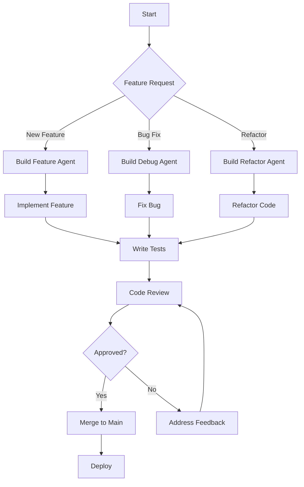

# Common Use Cases

## Role-Based Agent Configuration

### Software Development Teams

#### Backend Developer
```bash
# Get backend-focused agent configuration
prompt build --tool kilo --personas backend_developer --agent code

# Include debugging and testing skills
prompt build --tool kilo --personas backend_developer --agent code --include-skills debugging testing
```

#### Frontend Developer
```bash
# Get frontend-focused agent configuration
prompt build --tool kilo --personas frontend_developer --agent code

# Include UI/UX and accessibility skills
prompt build --tool kilo --personas frontend_developer --agent code --include-skills ui_design accessibility
```

#### DevOps Engineer
```bash
# Get DevOps-focused agent configuration
prompt build --tool kilo --personas devops_engineer --agent orchestator

# Include infrastructure and deployment skills
prompt build --tool kilo --personas devops_engineer --agent orchestrator --include-skills kubernetes docker ci_cd
```

#### QA/Test Engineer
```bash
# Get QA-focused agent configuration
prompt build --tool kilo --personas qa_engineer --agent test

# Include testing and quality assurance skills
prompt build --tool kilo --personas qa_engineer --agent test --include-skills test_automation quality_assurance
```

### Project-Specific Configuration

#### New Project Setup
```bash
# Create base configuration for new project
prompt init --project-name my-new-project --project-type web_application

# Generate agent configurations for team roles
prompt build --tool kilo --personas software_engineer devops_engineer qa_engineer --output-dir .promptosaurus/

# Set up CI/CD pipelines
prompt build --tool kilo --agent orchestrator --include-workflows deployment --output-dir .github/workflows/
```

#### Legacy System Modernization
```bash
# Analyze legacy system
prompt build --tool kilo --agent architect --include-workflows legacy_analysis --output-dir docs/

# Plan migration strategy
prompt build --tool kilo --agent migration --include-workflows migration_planning --output-dir docs/

# Generate refactoring agents
prompt build --tool kilo --personas software_engineer refactor --agent code --include-workflows refactoring --output-dir .promptosaurus/
```

## Tool-Specific Use Cases

### Kilo Code
```bash
# Create Kilo Code agent configurations
prompt build --tool kilo --agent code --output-dir .kilocode/agents/
prompt build --tool kilo --agent architect --output-dir .kilocode/agents/
prompt build --tool kilo --agent test --output-dir .kilocode/agents/

# Create Kilo Code skills
prompt build --tool kilo --skill debugging --output-dir .kilocode/skills/
prompt build --tool kilo --skill testing --output-dir .kilocode/skills/

# Create Kilo Code workflows
prompt build --tool kilo --workflow feature-development --output-dir .kilocode/workflows/
```

### Cline
```bash
# Create Cline agent configurations
prompt build --tool cline --agent code --output-dir .clinerules/
prompt build --tool cline --agent debug --output-dir .clinerules/
prompt build --tool cline --agent review --output-dir .clinerules/

# Create Cline workflows
prompt build --tool cline --workflow debugging --output-dir .clinerules/workflows/
```

### Claude
```bash
# Create Claude agent configurations
prompt build --tool claude --agent code --output-dir .claude/agents/
prompt build --tool claude --agent architect --output-dir .claude/agents/
prompt build --tool claude --agent explanation --output-dir .claude/agents/

# Create Claude skills
prompt build --tool claude --skill documentation --output-dir .claude/skills/
prompt build --tool claude --skill code_review --output-dir .claude/skills/
```

### GitHub Copilot
```bash
# Create GitHub Copilot agent configurations
prompt build --tool copilot --agent code --output-dir .github/copilot/agents/
prompt build --tool copilot --agent test --output-dir .github/copilot/agents/
prompt build --tool copilot --agent security --output-dir .github/copilot/agents/

# Create GitHub Copilot skills
prompt build --tool copilot --skill security_audit --output-dir .github/copilot/skills/
prompt build --tool copilot --skill performance_optimization --output-dir .github/copilot/skills/
```

## Workflow Automation

### Development Workflow


#### Automated Workflow Execution
```bash
# Feature development workflow
prompt build --tool kilo --agent code --include-workflows feature-development --variant verbose

# Debugging workflow
prompt build --tool kilo --agent debug --include-workflows debugging --variant verbose

# Code review workflow
prompt build --tool kilo --agent review --include-workflows code_review --variant verbose

# Deployment workflow
prompt build --tool kilo --agent orchestrator --include-workflows deployment --variant verbose
```

### CI/CD Integration
```yaml
# .github/workflows/promptosaurus.yml
name: Promptosaurus Configuration
on:
  push:
    branches: [ main ]
  pull_request:
    branches: [ main ]

jobs:
  build-configurations:
    runs-on: ubuntu-latest
    steps:
    - uses: actions/checkout@v3
    
    - name: Set up Python
      uses: actions/setup-python@v4
      with:
        python-version: '3.11'
    
    - name: Install Promptosaurus
      run: pip install -e .
    
    - name: Generate Agent Configurations
      run: |
        mkdir -p .kilocode/agents
        prompt build --tool kilo --agent code --output-dir .kilocode/agents/
        prompt build --tool kilo --agent test --output-dir .kilocode/agents/
        prompt build --tool kilo --agent debug --output-dir .kilocode/agents/
    
    - name: Generate Skill Configurations
      run: |
        mkdir -p .kilocode/skills
        prompt build --tool kilo --skill debugging --output-dir .kilocode/skills/
        prompt build --tool kilo --skill testing --output-dir .kilocode/skills/
        prompt build --tool kilo --skill documentation --output-dir .kilocode/skills/
    
    - name: Upload Configuration Artifacts
      uses: actions/upload-artifact@v3
      with:
        name: promptosaurus-config
        path: |
          .kilocode/
          .clinerules/
          .claude/
          .github/copilot/
```

## Troubleshooting Common Issues

### Configuration Not Being Recognized
**Symptoms:** AI tool doesn't recognize generated configuration
**Solutions:**
1. Verify file is in correct location for your tool
2. Check file format matches tool expectations (YAML vs Markdown vs JSON)
3. Ensure file has proper permissions
4. Confirm tool is reloaded/restarted after configuration change
5. Check for syntax errors in generated configuration

### Missing Skills or Workflows
**Symptoms:** Expected skills or workflows not appearing in output
**Solutions:**
1. Verify you included the correct component flags (--include-skills, etc.)
2. Check that the skill/workflow actually exists in the library
3. Ensure persona filtering isn't excluding the component
4. Verify build options are set correctly
5. Check for typos in skill/workflow names

### Performance Issues
**Symptoms:** Slow generation times
**Solutions:**
1. Use minimal variant for faster generation
2. Limit the number of components being built
3. Check if caching is enabled and working
4. Consider building only what you need rather than everything
5. Verify you're not accidentally triggering rebuilds unnecessarily

### Persona Filtering Not Working
**Symptoms:** Agents not being filtered correctly by persona
**Solutions:**
1. Verify persona names are spelled correctly
2. Check that personas exist in the personas.yaml file
3. Ensure universal agents are working as expected
4. Validate that agent definitions include proper persona mappings
5. Test with simple persona combinations first

## Best Practices

### For Individual Developers
1. **Start Small:** Begin with just the agents you need for your current task
2. **Use Minimal Variant:** Unless you need detailed comments, use minimal builds
3. **Leverage Personas:** Use role-based filtering to reduce noise
4. **Cache Results:** Save frequently used configurations to avoid rebuilding
5. **Keep Updated:** Regularly pull updates to get latest agents and skills

### For Teams
1. **Standardize Configurations:** Commit generated configurations to version control
2. **Create Templates:** Store commonly used build commands in team documentation
3. **Automate Generation:** Use CI/CD to generate configurations automatically
4. **Version Control:** Tag configurations with application versions
5. **Share Knowledge:** Document which agents/skills/workflows work best for different tasks

### For Advanced Users
1. **Extend IR Models:** Create custom agent models for specialized needs
2. **Build Custom Tools:** Create builders for unsupported AI tools
3. **Modify Templates:** Customize template handlers for specific output formats
4. **Add Personas:** Create new personas for specialized roles in your organization
5. **Optimize Performance:** Implement caching strategies for high-frequency usage
