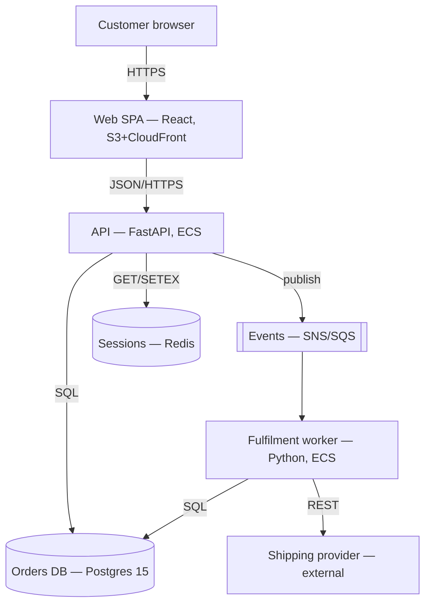

# Architecture Documentation (Verbose)

## Core Patterns

### Architecture Decision Records

An ADR records one decision at the moment it is made, with the information that
was actually available. Its value is not the decision — that is visible in the
code — but the *forces*: what was considered, what was rejected, and what the
choice costs. Six months later the code shows what; only the ADR shows why.

Rules that make ADRs work:

- One decision per record. A record covering "our data layer" is a design doc.
- Immutable once accepted. To change your mind, write a new ADR that supersedes
  the old one and mark the old one `Superseded by ADR-00NN`. Editing history
  destroys the reason the record exists.
- Numbered, sequential, in the repo under `docs/adr/`. Not in a wiki, where they
  drift away from the code they describe.
- Written *before* or *with* the change, never as a retrospective chore.

A real one, complete:

```markdown
# ADR-0021: Move session storage from sticky sessions to Redis

Status: Accepted (2026-01-18)
Deciders: platform team
Supersedes: ADR-0004 (ALB sticky sessions)

## Context
We run 12 API pods behind an ALB with cookie-based stickiness. Two problems have
become acute:

1. Deploys drop sessions. A rolling deploy evicts pods, and the ~9% of users
   pinned to an evicted pod are logged out. Support tickets spike after every
   release (median 31 tickets per deploy over the last 8 deploys).
2. Load is uneven. Stickiness pins long-lived browser sessions, so p99 CPU
   across pods varies 3.4x. We over-provision to the hottest pod.

We hold ~180k concurrent sessions, ~1.2 KB each (~220 MB), read on essentially
every request (~4k RPS) and written on ~3% of them.

## Decision
Store sessions in a Redis cluster (3 shards, 1 replica each), keyed
`sess:<id>`, TTL 14 days refreshed on write. Disable ALB stickiness. Sessions
remain opaque server-side state; we are not moving to JWTs.

## Alternatives considered
- **JWT sessions, no server state.** Rejected: we need immediate revocation for
  the admin "force logout" feature and for support-initiated account locks. A
  revocation list would reintroduce the shared store we would be avoiding.
- **Postgres session table.** Rejected: 4k RPS of session reads against the
  primary would roughly double its read load, and session reads sit on the
  latency path of every request.
- **Keep stickiness, drain connections on deploy.** Rejected: reduces but does
  not remove the logout problem, and does nothing for load skew.

## Consequences
+ Deploys stop logging users out; rolling restarts become boring.
+ Load balancing becomes round-robin; we expect to remove 3 of 12 pods.
+ Enables "log out all devices", previously impossible.
- Redis becomes a hard dependency on the request path. If Redis is fully
  unavailable, every request is unauthenticated. We mitigate with a 50 ms
  timeout, a 30 s in-process cache of validated sessions, and a runbook; we
  accept that a total Redis outage is an auth outage.
- Adds ~1.1 ms p50 / ~4 ms p99 to every request.
- New operational surface: cluster upgrades, failover behaviour, memory
  ceilings. ~250 MB working set today against 3 GB provisioned.

## Revisit if
Session payloads exceed ~4 KB (renegotiate what we store), concurrent sessions
exceed 1M, or Redis availability over a quarter falls below 99.95%.
```

Note what makes it useful: numbers in Context, rejected options *with the reason
for rejection*, and Consequences that name a real failure mode the team agreed
to accept. An ADR with no minus signs is marketing.

### The C4 Model

C4 gives four levels of zoom. The discipline is choosing which levels you will
actually maintain — usually one and two.

**Level 1 — System Context.** One box for your system, surrounded by users and
external systems. No internal detail. Answers "what is this and what does it
talk to". This is the diagram for a new joiner, a security reviewer, or a
product manager. It changes maybe twice a year.

**Level 2 — Container.** Deployable or runnable things: web app, API, worker,
database, queue — each with its technology and its protocol to its neighbours.
This is the highest-value diagram in most repos: it is what on-call needs at 3am
and what a new engineer needs on day one.



**Level 3 — Component.** Modules within a single container. Worth drawing only
for a container complex enough to need it, and only if someone owns keeping it
current. Otherwise it becomes the most confidently wrong artifact you own.

**Level 4 — Code.** Class and sequence diagrams. Do not hand-maintain these;
generate on demand from the IDE or from traces.

### Fighting Diagram Rot

Diagrams go stale because they restate a truth that lives somewhere else, and
nothing forces the two to agree. The fix is to remove the duplication, or to
make the disagreement visible.

| Artifact | Source of truth | Approach |
|---|---|---|
| Infra topology | Terraform / CloudFormation | Generate in CI from state or `cdk synth` |
| Service call graph | Traces, mesh config | Generate from Jaeger/Tempo or mesh config |
| Entity relationships | Live DB schema | Generate — see `mermaid-erd-creation` |
| Container diagram | Human intent | Hand-author as text, review in PRs |
| Context diagram | Human intent | Hand-author; it changes rarely |

For hand-authored diagrams, three habits keep them alive:

1. **Diagrams-as-code, in the repo.** Mermaid, Structurizr DSL, PlantUML — text
   that diffs. A `.png` exported from a drawing tool cannot be reviewed, so it
   never is.
2. **Co-locate with the code they describe.** A diagram in `docs/` beside the
   service gets edited when the service changes. One on a wiki does not.
3. **Put them in the definition of done.** A PR that adds a container or an
   external dependency updates the Level 2 diagram in the same PR. Reviewers
   enforce this, or it does not happen.

Give every generated diagram a footer: source, generator, timestamp. A reader
who can see how a diagram was produced can judge whether to trust it.

### arc42 for Whole-System Documentation

ADRs are decision-shaped; sometimes you need a document describing the system as
it stands — for a new team, an audit, or a handover. arc42 supplies a stable
12-section skeleton so nobody argues about structure.

| § | Section | Keep it if |
|---|---|---|
| 1 | Introduction and goals | Always — top 3 quality goals, with numbers |
| 2 | Constraints | There are real ones (compliance, existing stack, budget) |
| 3 | Context and scope | Always — C4 Level 1 in prose plus a diagram |
| 4 | Solution strategy | Always — one page, the shape of the answer |
| 5 | Building block view | Always — C4 Level 2, decomposed |
| 6 | Runtime view | For the 2–3 flows that matter (checkout, auth, batch close) |
| 7 | Deployment view | Non-trivial topology, multi-region, or regulated |
| 8 | Crosscutting concepts | Always — auth, errors, logging, tenancy, i18n |
| 9 | Architecture decisions | Always — as links to ADRs, not copies |
| 10 | Quality requirements | Always — scenarios with thresholds |
| 11 | Risks and technical debt | Always — most-read section, most often skipped |
| 12 | Glossary | The domain has jargon (it does) |

Sections 1, 3, 4, 5, 8, 9 and 11 carry nearly all the value. Delete empty
sections rather than leaving "TBD" — a template full of TBDs teaches readers the
document is unreliable.

### Quality Attributes as Scenarios

Non-functional requirements written as adjectives cannot be designed against or
verified. Write them as scenarios: source, stimulus, environment, response,
measure.

❌ "The API must be highly available and fast."

✅ "Under normal load (≤ 4k RPS), 99% of `POST /orders` complete in < 200 ms
measured at the ALB. During a single-AZ failure the API continues serving with
p99 < 500 ms and no elevated error rate, recovering within 90 s."

The second version tells you to test AZ failure, sets a budget you can spend
during design, and tells a future reader whether a proposed change violates a
commitment or merely offends taste.

## Common Anti-Patterns

❌ **The one big "Architecture" wiki page.** Nobody owns it, everything is in it,
so it is comprehensively out of date and no part of it is trusted.
✅ A small maintained set: Context, Container, ADRs, crosscutting concepts.
Delete what you will not maintain.

❌ **ADRs written after the fact to satisfy a process gate.** They reconstruct a
justification for what was already built and omit the alternatives — precisely
the information worth recording.
✅ Write the ADR while the decision is live and the alternatives still feel real.

❌ **Editing an accepted ADR when the decision changes.** The record now claims
the team knew in March what it learned in September.
✅ New ADR with `Supersedes:`; mark the old one superseded, leave its text alone.

❌ **Consequences listing only benefits.** A decision with no downside was not a
decision, it was a preference.
✅ Name the cost, the new failure mode, and the ceiling you are accepting.

❌ **Hand-drawing things a machine already knows** — VPC layouts, table
relationships, service dependencies.
✅ Generate them in CI from Terraform state, the schema, or trace data.

❌ **Binary images with no source.** Cannot be diffed, cannot be reviewed, cannot
be updated by anyone but the original author.
✅ Diagrams-as-code committed beside the service.

❌ **Level 3 and 4 diagrams while Level 1 is missing.** Detail is easy and
comforting; the orienting overview is the hard, valuable one.
✅ Earn detail levels by first maintaining Context and Container.

❌ **Documenting the aspiration instead of the system.** The doc shows the
event-driven design; production is still the monolith with a cron.
✅ Document what runs, label target state as target state, and record the gap in
the risks and technical debt section.

## Architecture Documentation Checklist

- [ ] ADRs live in the repo, numbered, one decision each
- [ ] Every ADR names the alternatives and why they were rejected
- [ ] Every ADR's Consequences section contains at least one real cost
- [ ] Every ADR states what would cause it to be revisited
- [ ] Superseded ADRs are marked, not edited or deleted
- [ ] A C4 Level 1 Context diagram exists and is current
- [ ] A C4 Level 2 Container diagram exists, with technologies and protocols
- [ ] No hand-maintained Level 4 diagrams
- [ ] Diagrams are text (Mermaid / Structurizr / PlantUML) in version control
- [ ] Infra, schema, and dependency diagrams are generated, not drawn
- [ ] Generated diagrams carry source, generator, and timestamp
- [ ] Updating the Container diagram is part of the definition of done
- [ ] Quality attributes are written as scenarios with thresholds
- [ ] Known risks and technical debt are recorded and dated
- [ ] Docs describe what runs today; target state is labelled as such
- [ ] A new engineer can find the system's entry points from the docs alone
